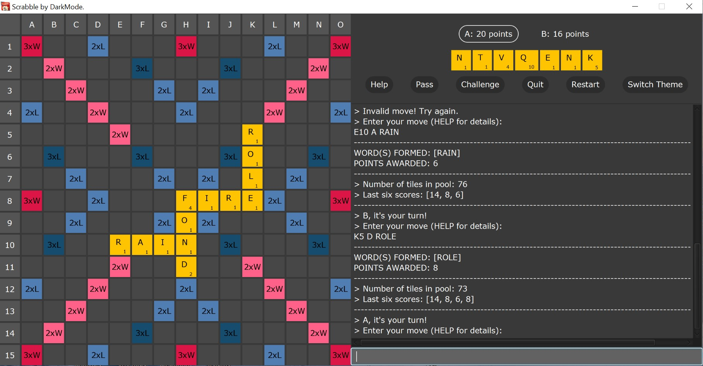
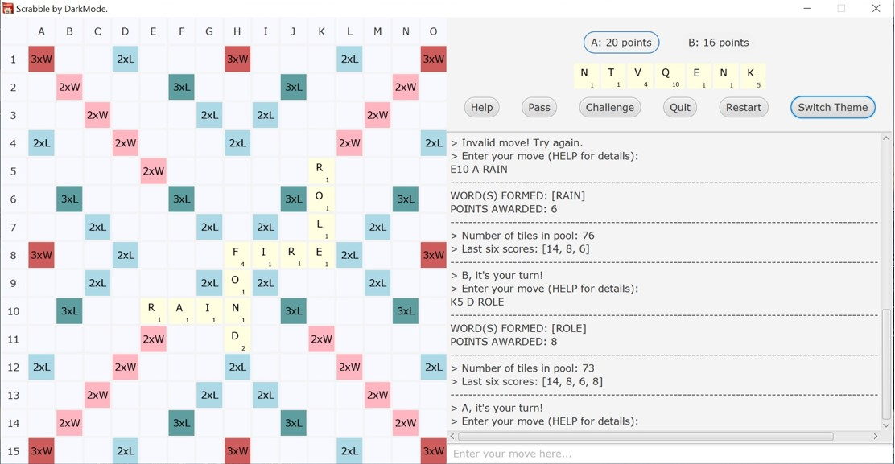

# Scrabble by DarkMode.
* Java implementation of the popular word game, Scrabble. 
* Developed with IntelliJ IDEA, for COMP20050: Software Engineering Project 2, 

#### Play Game:
Download and run (double click) the executable [JAR file](./out/artifacts/DarkMode/DarkMode.jar). 

Dark Theme:
    

Light Theme: 
  

#### Dependencies:
* Java 8
* JUnit 5.4

#### Authors:
* Katarina Cvetkovic ([@katarinac](https://github.com/katarinac))
* Jason Tee ([@AmplifiedHuman](https://github.com/AmplifiedHuman))
* Rajit Banerjee ([@rajitbanerjee](https://github.com/rajitbanerjee))
