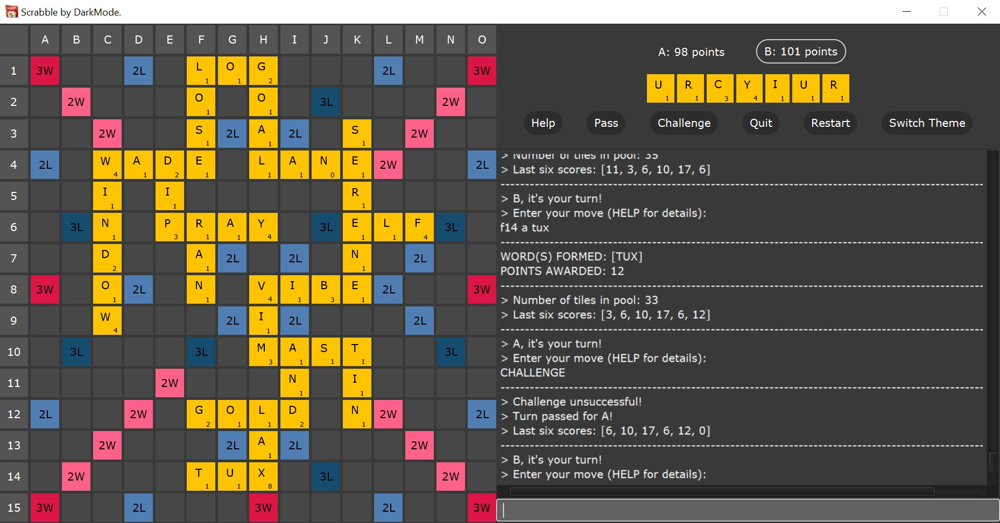
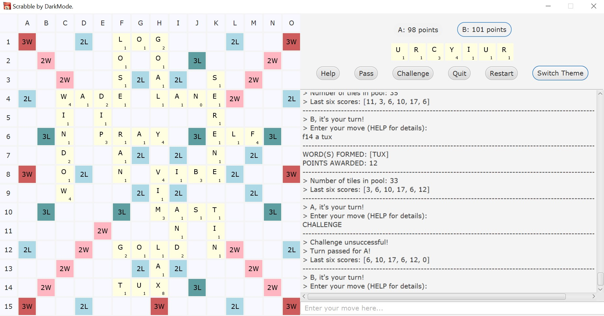

# Scrabble by DarkMode.
Java implementation of the popular word game, [Scrabble](https://en.wikipedia.org/wiki/Scrabble).   
Developed for [COMP20050: Software Engineering Project 2](https://sisweb.ucd.ie/usis/!W_HU_MENU.P_PUBLISH?p_tag=MODULE&MODULE=COMP20050) 
at [UCD](https://www.ucd.ie/cs/).

## Getting Started
Follow these instructions to get a copy of the project running on your local machine.

### Prerequisites
Java 13 is required for the project. Install JDK 13 from Oracle 
[here](https://www.oracle.com/java/technologies/javase-jdk13-downloads.html), 
in case you don't have it.

### Build and run 
Clone the repository, then (using Gradle):
* Build project and run JUnit tests
```
./gradlew build
```
* Run the game
```
./gradlew run
```  

*Note*: If you'd like to run the JAR file created by Gradle, you would need to install JavaFX separately, set path to
 the installed JavaFX and add the required [VM arguments](https://stackoverflow.com/a/60113010/12842278) ```--module-path /path/to/javafx/lib --add-modules javafx
 .controls,javafx
 .fxml,javafx.web```. Building from source with Gradle is simpler (as shown above).

Dark Theme:  
     

Light Theme:   
     


## Documentation
Use the command to generate API documentation under **build > docs > javadoc**:
```
./gradlew javadoc
```  
### TODO/Upcoming Features
* Fix MacOS display issue
* Integrate Scrabble bot into the main branch

## Authors
Team 15: DarkMode.
* Katarina Cvetkovic ([@katarinac](https://github.com/katarinac))
* Jason Tee ([@AmplifiedHuman](https://github.com/AmplifiedHuman))
* Rajit Banerjee ([@rajitbanerjee](https://github.com/rajitbanerjee))

## Acknowledgements 
* Dr. Chris Bleakley (lecturer)
* Duncan Wallace (TA), and the team of lab demonstrators.
